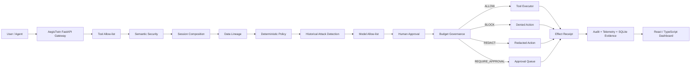

<div align="center">

# 🛡️ AegisTwin

### **Governed execution for agentic AI systems**


<br/>

[](https://www.python.org/)
[](https://fastapi.tiangolo.com/)
[](frontend/)
[](app/persistence/)
[](app/security/)
[](evidence/01-automated-tests.txt)

**AegisTwin sits between an AI agent and the tools it wants to use.**  
Before an action executes, AegisTwin evaluates intent, provenance, data lineage, policy, session composition, approvals, budgets, historical attack signatures, and semantic risk — then produces an auditable decision.

[Judge Evidence](#-judge-evidence) •
[Architecture](#-architecture) •
[Security Controls](#-security-controls) •
[Benchmark](#-benchmark--robustness) •
[Run Locally](#-run-locally) •
[API](#-api-surface)

</div>

---

## ✦ Why AegisTwin

Modern AI agents do not only generate text. They can call APIs, read databases, transform sensitive information, send external requests, invoke tools, and chain actions across a session.

That changes the security problem.

A prompt can look harmless in isolation while becoming dangerous when combined with:

- untrusted instructions,
- sensitive data,
- a transformation step,
- an external destination,
- excessive permissions,
- a hidden model/tool substitution,
- or an accumulated session history.

**AegisTwin treats the agent as an execution system, not just a chatbot.**

Instead of asking only:

> “Is this prompt malicious?”

AegisTwin asks:

> **“Given the original intent, instruction origin, data lineage, tool sequence, destination, active policy, historical behavior, and current resource budget — should this action be allowed to execute?”**

---

## ⚡ The idea in one flow

```text
User / Agent Request
        │
        ▼
┌───────────────────────────────┐
│       AegisTwin Gateway       │
└───────────────────────────────┘
        │
        ├── Tool allow-list
        ├── Instruction provenance
        ├── Semantic injection detection
        ├── Session composition analysis
        ├── Data-lineage checks
        ├── Deterministic policy
        ├── Historical attack signatures
        ├── Model allow-list
        ├── Human approval
        └── Resource / cost budgets
        │
        ▼
 ALLOW / BLOCK / REDACT / REQUIRE_APPROVAL
        │
        ▼
  Effect receipt + audit evidence
```

AegisTwin is designed around one principle:

> **No sensitive action should execute merely because a model decided to call a tool.**

---

## 🧠 Observe → Discover → Trace → Twin → Compile → Prove → Enforce

| Stage | What AegisTwin does |
|---|---|
| **Observe** | Intercepts tool/action requests before execution |
| **Discover** | Identifies tools, origins, models, sensitive labels, destinations and session behavior |
| **Trace** | Preserves provenance and data lineage across transformations |
| **Twin** | Builds a security-oriented model of the agent workflow and attack path |
| **Compile** | Converts security findings into concrete policy/guardrail decisions |
| **Prove** | Produces decisions, receipts, telemetry, audit records and reproducible evidence |
| **Enforce** | Allows, blocks, redacts or requires approval before the action executes |

---

## 🏗 Architecture



### Core backend

```text
app/
├── agents/          Agent/runtime support
├── controls/        Budget, policy and approval controls
├── demo/            Demonstration workflows
├── gateway/         Pre-execution control gateway
├── persistence/     SQLite evidence persistence
├── security/        Semantic + composition security
├── twin/            Attack-path / digital-twin analysis
├── audit.py         Structured security audit log
├── auth.py          Management API RBAC
├── config.py        Runtime policy projection
├── contracts.py     Shared typed contracts
├── main.py          FastAPI application
├── policy_config.py Validated central policy loader
├── store.py         Runtime evidence abstraction
└── telemetry.py     Runtime metrics
```

---

## 🔐 Security controls

AegisTwin combines **deterministic**, **semantic**, **stateful**, and **governance** controls.

| Control | Purpose |
|---|---|
| **Tool allow-list** | Prevents unknown or unauthorized tools from executing |
| **Semantic prompt-injection detection** | Detects injection/jailbreak intent using ProtectAI DeBERTa plus deterministic fallback |
| **Session composition analysis** | Detects dangerous combinations that may be benign individually |
| **Intent-action mismatch** | Blocks actions not authorized by the original user intent |
| **Data lineage** | Tracks sensitive labels through derived artifacts and transformations |
| **Sensitive external transfer control** | Prevents unauthorized exfiltration |
| **Historical attack detection** | Blocks known exploit signatures from the configured attack feed |
| **Model allow-list** | Prevents unapproved model substitution |
| **Human approval** | Binds approval to sensitive actions rather than granting blanket permission |
| **Budget governance** | Limits calls, external HTTP use, cost, turns, tokens and runtime |
| **RBAC** | Separates viewer, security and admin management capabilities |
| **Policy hot reload** | Applies validated policy changes without rebuilding the application |
| **Audit + persistence** | Records security evidence and durable runtime state |
| **Redaction action** | Supports deterministic redaction as an enforcement outcome |

### Decision actions

```text
ALLOW
BLOCK
REDACT
REQUIRE_APPROVAL
```

---

## 🤖 Hybrid semantic security

AegisTwin does not depend on one classifier.

Its semantic layer combines:

```text
Deterministic patterns
        +
ProtectAI DeBERTa prompt-injection classifier
        +
Instruction-origin provenance
        +
Deterministic fallback
```

The semantic detector uses:

```text
protectai/deberta-v3-base-prompt-injection-v2
```

with a centrally configured threshold.

Trusted origins can avoid unnecessary model false positives while explicit deterministic attacks are still blocked.

### Model-degradation behavior

AegisTwin also tests what happens when the semantic classifier is intentionally unavailable.

Evidence:

```text
ATTACKS BLOCKED DURING MODEL FAILURE: 4/4
BENIGN REQUESTS PRESERVED:           3/3
CASES HANDLED BY FALLBACK:           7/7
MODEL FAILURE SECURITY BYPASSES:     0

AEGISTWIN MODEL-FAILURE ROBUSTNESS: PASSED
```

> This evidence demonstrates preservation of the known deterministic fallback controls during classifier failure. It does not claim that every novel semantic attack can be detected without the model.

---

## 🧬 Session composition security

Many agent attacks are not visible in a single prompt.

AegisTwin evaluates the **composition of the session**.

Example:

```text
Untrusted document
      ↓
Summarizer
      ↓
CustomerPII / DerivedFrom<CustomerPII>
      ↓
external_http
      ↓
Original intent did NOT authorize external transfer
      ↓
BLOCK
```

Detected categories include:

- `COMPOSITIONAL_DATA_EXFILTRATION`
- `INTENT_ACTION_MISMATCH`
- `UNTRUSTED_EXTERNAL_ACTION`
- `DANGEROUS_TOOL_COMPOSITION`

### Full-system robustness result

```text
DANGEROUS COMPOSITIONS PREVENTED: 5/5
LEGITIMATE WORKFLOWS PRESERVED:    2/2
DANGEROUS ACTIONS EXECUTED:        0
FULL-SYSTEM ATTACK SUCCESS RATE:   0.00%

AEGISTWIN FULL-SYSTEM ROBUSTNESS: PASSED
```

---

## 🧾 Evidence-first execution

Every important security decision can produce evidence around:

- call ID,
- session ID,
- tool,
- instruction origin,
- decision,
- risk,
- reason,
- matched control,
- execution status,
- receipt ID,
- policy version,
- latency,
- lineage,
- composition analysis.

This makes the system useful not only as an enforcement layer, but as an **explainable security control plane**.

---

## 📊 Benchmark & robustness

AegisTwin ships with a reproducible positive + negative benchmark rather than relying only on hand-picked demos.

### Judge benchmark

| Metric | Result |
|---|---:|
| Total benchmark cases | **75** |
| Attack cases | **50** |
| Legitimate cases | **25** |
| Security categories | **15** |
| Unique scenario IDs | **75** |
| Scenario validation | **PASSED** |
| Automated tests | **218 passed** |

### Adversarial semantic robustness

```text
ORIGINAL SEMANTIC ATTACKS BLOCKED:  20/20
PERTURBED SEMANTIC ATTACKS BLOCKED: 19/19
BENIGN NEAR-MISSES ALLOWED:         19/20

SEMANTIC ATTACK SUCCESS RATE:        0.00%
FALSE POSITIVE RATE:                 5.00%

AEGISTWIN SEMANTIC ATTACK ROBUSTNESS: PASSED
```

The single benign false positive is preserved as evidence rather than hidden by weakening the classifier.

### Repeatability

The same semantic cases are repeatedly evaluated to detect unstable decisions or random flips.

```text
AEGISTWIN REPEATABILITY ROBUSTNESS: PASSED
```

### Policy mutation

The exact same request is tested under three validated policies:

```text
DEFAULT  cost limit 100 → ALLOW
STRICT   cost limit  25 → BLOCK
RELAXED  cost limit 200 → ALLOW
```

Result:

```text
POLICY MUTATION CHANGED BEHAVIOR: YES
RELAXED POLICY RESTORED BEHAVIOR: YES
STRICT VIOLATION EXECUTED:        NO

AEGISTWIN POLICY MUTATION ROBUSTNESS: PASSED
```

This demonstrates that enforcement follows the active policy rather than hard-coded outcomes.

### Load / stress robustness

A local in-process gateway stress run evaluates 200 requests:

```text
ATTACKS BLOCKED:            100/100
BENIGN REQUESTS ALLOWED:    100/100
UNEXPECTED DECISIONS:       0
CRASHES:                    0
EVALUATION COMPLETION RATE: 100.00%
```

Measured local gateway evaluation latency in that test:

```text
Average: 0.07 ms
P95:     0.12 ms
P99:     0.20 ms
```

> These are **local in-process gateway timings**, not browser/network/production end-to-end latency.

---

## 🧪 Live judge demo

The live demo sends five requests through the real FastAPI gateway.

| Case | Expected result |
|---|---|
| Legitimate internal summary | ✅ ALLOW + execute |
| Indirect prompt injection | 🛑 BLOCK |
| Unknown tool request | 🛑 BLOCK |
| Sensitive external transfer | 🛑 BLOCK |
| Excessive estimated cost | 🛑 BLOCK |

Latest verified result:

```text
EVALUATED CALLS: 5
ALLOWED:         1
BLOCKED:         4
EXECUTED:        1
PREVENTED:       4
RECORDED RECEIPTS:  1
RECORDED DECISIONS: 5

AEGISTWIN LIVE JUDGE DEMO: PASSED
```

Run it with:

```bash
python -m scripts.run_live_judge_demo
```

---

## 🏛 Policy-driven enforcement

The central policy is:

```text
policies/aegis.yaml
```

Additional profiles:

```text
policies/aegis-strict.yaml
policies/aegis-relaxed.yaml
```

Historical attack signatures:

```text
policies/historical_attack_feed.json
```

Policy controls include:

```yaml
controls:
  tool_allow_list: true
  semantic_detection: true
  composition_analysis: true
  deterministic_policy: true
  data_lineage: true
  human_approval: true
  budget_enforcement: true
  historical_attack_detection: true
```

Policy configuration also governs:

- approved tools,
- approved models,
- semantic threshold,
- sensitive labels,
- external destinations,
- session budgets,
- enforcement actions,
- historical signatures,
- non-overridable organization ceilings.

### Organization ceilings

Policy validation prevents a runtime configuration from weakening non-overridable organizational security constraints.

Examples include permanent sensitive labels, permanently blocked external destinations, maximum budgets and required block actions.

---

## 💰 Resource governance

AegisTwin governs more than API spend.

Configurable session limits include:

- maximum tool calls,
- maximum external HTTP calls,
- maximum estimated cost,
- maximum agent turns,
- maximum input tokens,
- maximum output tokens,
- maximum execution duration,
- maximum model runtime.

A request that exceeds the active budget is blocked **before execution**.

---

## 👥 Management RBAC

Management endpoints support three roles:

| Role | Typical access |
|---|---|
| **viewer** | telemetry, runtime status, session evidence, persistence status |
| **security** | viewer access + audit events/export |
| **admin** | security access + policy reload + runtime reset |

Authentication uses:

```text
X-API-Key
```

with environment-configured management credentials.

### Important

Do not commit real management keys.

The live judge demo generates a temporary key at runtime for demonstration purposes.

---

## 📡 API surface

### Public / evaluation

```http
GET  /health
GET  /policy
GET  /capabilities

POST /gateway/evaluate
POST /benchmark/extended
POST /attack-my-agent
```

### Management / evidence

```http
GET  /telemetry
GET  /runtime/status
GET  /runtime/sessions/{session_id}
GET  /persistence/status

GET  /audit/events
GET  /audit/export

POST /policy/reload
POST /runtime/reset
```

Role requirements depend on endpoint sensitivity.

---

## 🧪 Judge evidence

### **Start here if you are evaluating AegisTwin**

All reproducible evidence is committed under:

```text
evidence/
```

| Evidence file | What it proves |
|---|---|
| [`01-automated-tests.txt`](evidence/01-automated-tests.txt) | Full automated test suite |
| [`02-benchmark-summary.txt`](evidence/02-benchmark-summary.txt) | Benchmark summary |
| [`02-judge-suite-final.txt`](evidence/02-judge-suite-final.txt) | 75-case final judge validation |
| [`03-live-judge-demo-final.txt`](evidence/03-live-judge-demo-final.txt) | Real gateway live demo |
| [`04-prompt-injection-blocked.json`](evidence/04-prompt-injection-blocked.json) | Structured blocked prompt-injection response |
| [`05-adversarial-semantic-robustness.txt`](evidence/05-adversarial-semantic-robustness.txt) | Original + perturbed semantic attacks |
| [`06-full-system-robustness.txt`](evidence/06-full-system-robustness.txt) | Composition/exfiltration robustness |
| [`08-repeatability-robustness.txt`](evidence/08-repeatability-robustness.txt) | Decision repeatability |
| [`09-policy-mutation-robustness.txt`](evidence/09-policy-mutation-robustness.txt) | Policy-driven behavior |
| [`10-load-robustness.txt`](evidence/10-load-robustness.txt) | 200-evaluation stress test |
| [`rbac-verification.txt`](evidence/rbac-verification.txt) | Management RBAC verification |
| [`full-test-suite.txt`](evidence/full-test-suite.txt) | Additional complete test output |

### Reproduction scripts

```text
scripts/run_judge_tests.sh
scripts/run_live_judge_demo.py
scripts/run_adversarial_robustness.py
scripts/run_system_robustness.py
scripts/run_fallback_robustness.py
scripts/run_repeatability_robustness.py
scripts/run_policy_mutation_robustness.py
scripts/run_load_robustness.py
```

---

## 🚀 Run locally

### 1. Clone

```bash
git clone https://github.com/Eman0989/aegistwin.git
cd aegistwin
git switch integration
```

### 2. Create the Python environment

```bash
python3.11 -m venv .venv
source .venv/bin/activate
```

### 3. Install backend dependencies

```bash
pip install -r requirements.txt
```

If running the local semantic model dependencies, install the AI requirements used by the project as well.

### 4. Start the backend

```bash
uvicorn app.main:app --reload
```

Backend:

```text
http://127.0.0.1:8000
```

### 5. Start the frontend

```bash
cd frontend
npm install
npm run dev
```

The Vite frontend normally runs on:

```text
http://localhost:5173
```

---

## ✅ Run the complete verification

### Full automated suite

```bash
pytest -q
```

Expected latest verified result:

```text
218 passed
```

### Judge suite

```bash
./scripts/run_judge_tests.sh
```

Expected:

```text
TOTAL CASES: 75
ATTACK CASES: 50
LEGITIMATE CASES: 25
SECURITY CATEGORIES: 15
UNIQUE IDS: 75
SCENARIO VALIDATION: PASSED

AEGISTWIN JUDGE TEST SUITE: PASSED
```

### Live gateway demo

```bash
python -m scripts.run_live_judge_demo
```

Expected final line:

```text
AEGISTWIN LIVE JUDGE DEMO: PASSED
```

---

## 🖥 Frontend

The repository includes a React + TypeScript dashboard under:

```text
frontend/
```

The UI is designed to surface real backend state rather than invented static numbers.

It can consume:

- policy state,
- control capabilities,
- runtime telemetry,
- session evidence,
- benchmark results,
- attack-path analysis,
- audit information.

---

## 🗃 Persistence & audit

AegisTwin uses SQLite for durable runtime evidence.

The runtime can persist:

- sessions,
- policy decisions,
- receipts,
- composition analyses,
- guardrails,
- approvals,
- attack evidence.

Audit data can be exposed as structured JSON and exported as CSV.

---

## 🔁 Hot policy reload

Administrators can reload a validated policy without rebuilding the application:

```http
POST /policy/reload
```

Reload is applied atomically.

If runtime application fails, the previous policy and runtime-control state are restored.

---

## 🧪 Repository layout

```text
aegistwin/
├── app/
│   ├── agents/
│   ├── controls/
│   ├── demo/
│   ├── gateway/
│   ├── persistence/
│   ├── security/
│   └── twin/
│
├── benchmarks/
│   ├── reports/
│   ├── scenarios/
│   ├── generate_scenarios.py
│   └── run_agent_benchmark.py
│
├── evidence/
│   └── reproducible judge evidence
│
├── frontend/
│   ├── public/
│   └── src/
│
├── policies/
│   ├── aegis.yaml
│   ├── aegis-strict.yaml
│   ├── aegis-relaxed.yaml
│   └── historical_attack_feed.json
│
├── scripts/
│   ├── run_judge_tests.sh
│   ├── run_live_judge_demo.py
│   └── robustness runners
│
├── tests/
│   ├── twin/
│   └── backend/security/runtime tests
│
├── README.md
├── pyproject.toml
├── requirements.txt
└── requirements-ai.txt
```

---

## 🎯 Threats AegisTwin is designed to address

```text
Prompt injection
Indirect prompt injection
Jailbreak commands
Intent/action mismatch
Sensitive-data exfiltration
Dangerous tool composition
Untrusted external actions
Unknown tool execution
Unknown model execution
Historical exploit signatures
Approval misuse
Budget abuse
Excessive agent loops
Resource exhaustion
Policy drift
```

The key distinction is that AegisTwin does not attempt to solve these only at the prompt layer.

It controls the **execution boundary**.

---

## 🔬 Example blocked request

An untrusted document asks the agent to ignore instructions and reveal the system prompt.

AegisTwin returns a structured decision similar to:

```json
{
  "decision": {
    "action": "BLOCK",
    "risk_level": "CRITICAL",
    "reason": "Semantic control blocked PROMPT_INJECTION"
  },
  "executed": false,
  "receipt": null
}
```

No effect receipt is created because the action never executes.

---

## 🧭 Design principles

**Default to governed execution.**  
Model output is a proposal, not authority.

**Preserve provenance.**  
Instruction origin and sensitive-data lineage matter.

**Evaluate sessions, not only messages.**  
Risk can emerge from composition.

**Keep deterministic controls around probabilistic models.**  
A classifier should not be a single point of security failure.

**Make security observable.**  
Every decision should be explainable and reproducible.

**Keep policy externalized.**  
Security behavior should change through validated configuration rather than code edits.

---

## ⚠️ Scope & limitations

AegisTwin is a hackathon / research prototype, not a claim of complete production security.

Important boundaries:

- semantic classifiers can produce false positives and false negatives,
- deterministic fallback protects known explicit patterns but does not guarantee detection of every novel semantic attack during model outage,
- benchmark results describe the included evaluation suite rather than every possible attack,
- local latency measurements are not equivalent to production end-to-end latency,
- management API keys are suitable for controlled demonstration environments; production deployments should use a stronger identity/session architecture,
- real-world deployment would require additional operational hardening, monitoring, key management and infrastructure controls.

These limitations are kept explicit because the goal is **measurable, auditable security**, not inflated claims.

---

## 🏆 What makes AegisTwin different

Most AI security demos stop at:

```text
prompt → classifier → safe / unsafe
```

AegisTwin instead evaluates:

```text
intent
  + provenance
  + model
  + tool
  + data lineage
  + session history
  + destination
  + policy
  + approval
  + resource budget
  = execution decision
```

That makes it closer to an **AI execution control plane** than a prompt filter.

---

## 🔮 Future work

Potential extensions include:

- richer digital-twin attack-graph visualization,
- distributed policy enforcement,
- external SIEM integrations,
- OIDC / enterprise identity,
- richer approval workflows,
- signed audit evidence,
- policy simulation before deployment,
- additional model/provider adapters,
- larger adversarial corpora,
- distributed tracing,
- production deployment profiles.

---

## 👩‍💻 Project

Built for a hackathon around the challenge of making agentic AI systems **observable, governable and safer before execution**.

**Repository:** `Eman0989/aegistwin`  
**Judging branch:** `integration`

---

<div align="center">

### 🛡️ AegisTwin

**The model proposes. The control plane decides.**


</div>
